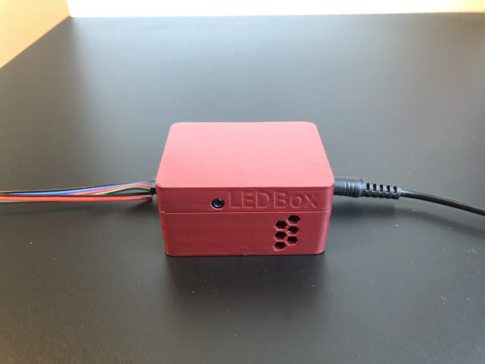
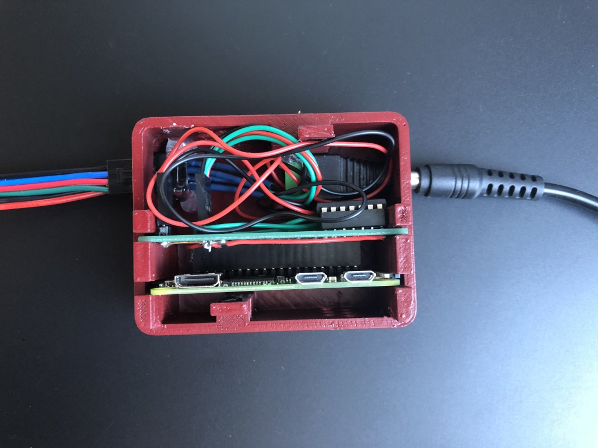
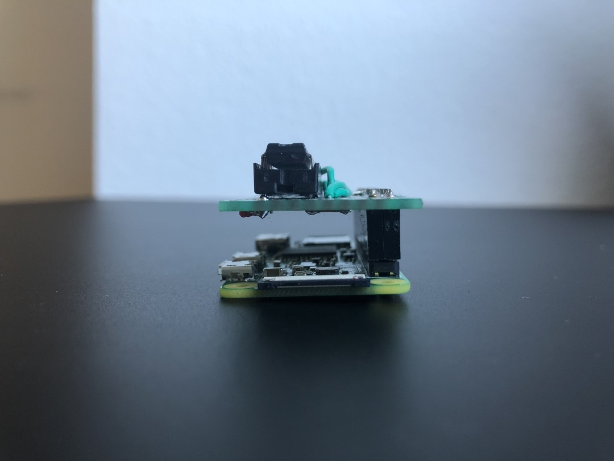
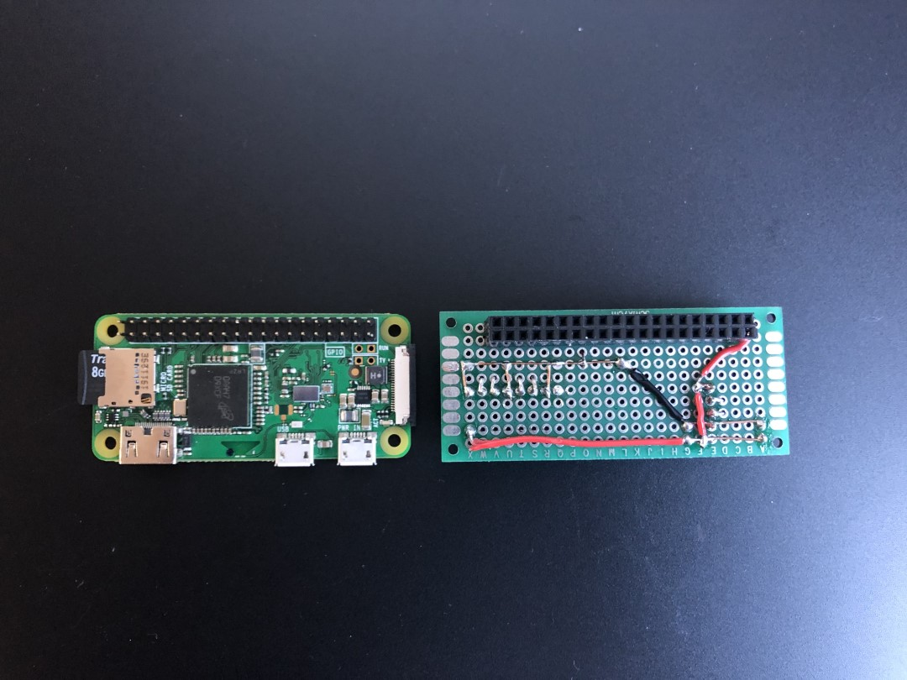
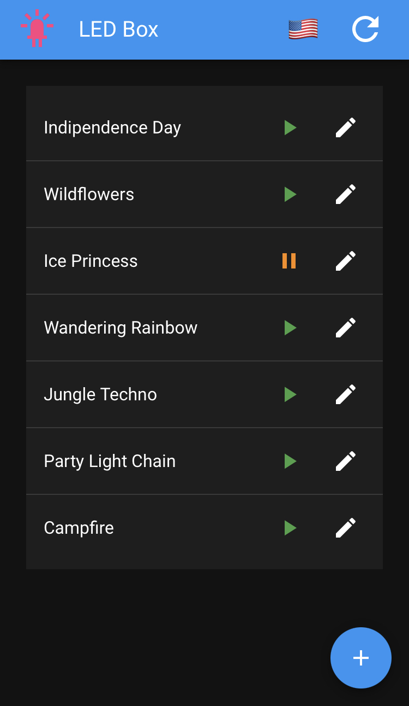
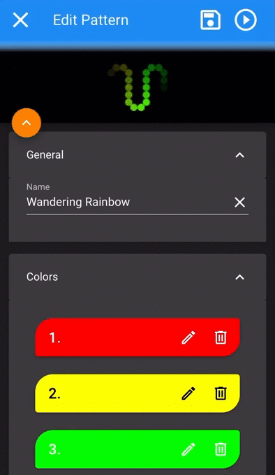

# LED Box
### ...like a Jukebox - only with LEDs

  

## Introduction

LED Box is a project created and written for a Raspberry Pi connected to a WS2801 LED strip. The aim is to provide an interactive lighting for parties and events. The idea is that the Raspberry Pi can be accessed and controlled via Wifi and a simple Website. Patterns which describe a combination of colors and animation can be created, edited and played by everyone attending the event. Of course the LED Box can also be used only at home for ambient lighting. 

 

## Hardware

The LED Box is based on a Raspberry Pi W (W stands for Wireless) and a 5m long LED strip with a WS2801 controller. You should use a 5V power supply with at least 10a. 

I designed and printed a case with my 3D printer (LEDBoxCase.stl). 

Therefore my wiring is very specialized and compact to fit in the case: A circuit board with the connectors for power and the LED controller and the level shifter is plugged onto the pins of the Raspberry PI. The exact wiring is described by the led-box.fzz file for [Fritzing](https://fritzing.org/).

  

 

## Setup

To install the software on a Rasberry Pi, follow the [installation instruction](setup/Installation.md).

 

## Frontend

The frontend is written in Vue.js and uses the [Vuetify](https://vuetifyjs.com) component library. It fetches the patterns from the backend and lets the user edit, save and play these patterns. To simplfiy the editing of patterns, the UI provides a preview for any pattern directly on the website. (It took me way to long to implement this...) The language can be switched between American English and German.

 

Also there is a hidden "admin area" to shutdown the server or reset/delete the saved pattterns. It can be accessed by clicking 5 times on the LED icon in the upper left corner.

 

## Backend

The backend is written in python and is heavily based on the [WS2801 library by Adafruit](https://github.com/adafruit/Adafruit_CircuitPython_WS2801). It provides a [REST interface](openapi.yaml) used by the frontend. It is hosted by a uWSGI web server with a file socket interface. This interface is reverse proxied by the central Nginx server on the Raspberry Pi.
